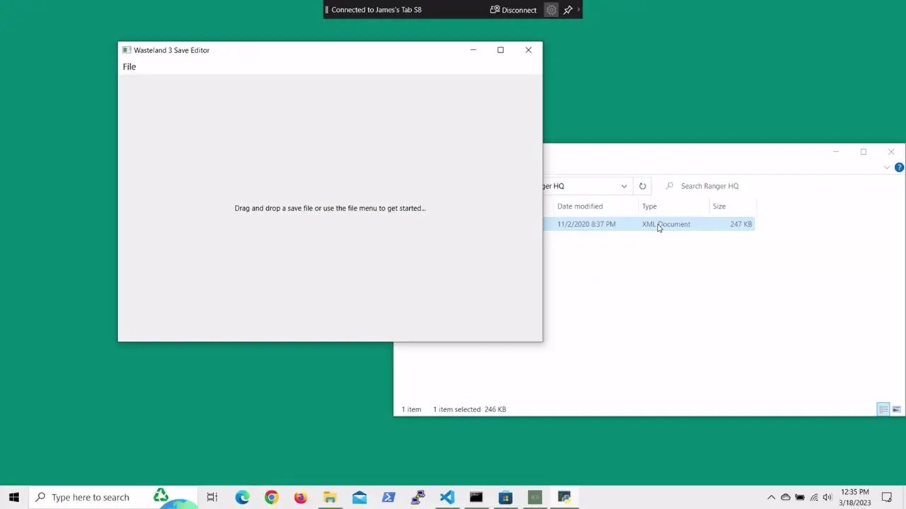

# w3se

A save game editor for inXile Entertainment's Wasteland 3

*This was tested against save files from the Linux Steam version (1.6.9.420.309496) without any DLC.*

## Usage

After **Installing** (see below), run `python src/main.py` to launch.

Use the `File- > Load Save Game` dialog. Browse to your save game file, and edit away!

## Features

- View party members and edit their stats
- Attributes and Attribute points
- Add/Edit/Remove items in the party inventory
- Add perks to each character
- Edit money

## Installation

1. Clone the repository to your local system
  - `git clone https://github.com/stolinator/w3se.git`
2. [Optional] set up a virtual environment
  - `cd` into the repository folder
  - `python3 -m venv w3se`
  - `source w3se/bin/activate`
3. Use `pip` to install dependencies
  - `pip install -r requirements.txt`
      * *If you are on Windows, you'll need a [patched version](https://www.lfd.uci.edu/~gohlke/pythonlibs/#python-lzf) of `python-lzf`* (see [https://github.com/teepark/python-lzf/issues/5](https://github.com/teepark/python-lzf/issues/5))
4. Run `main.py`
  - `python src/main.py`

## Bugs

Editing certain values without the game engine running may have unwanted side effects. This is
not a comprehensive list, just some observations I've made from using the editor.

*If adding perks to a character:*
  - You can safely add perks with passive bonuses
  - If you want to add an ability-granting perk (e.g. 'Rally') your character will not get the linked ability in-game
  - Takeaway: add perk points for non-passive perks and add these perks in-game

*If increasing character's skills:*
  - Using the editor to max out a skill level will not grant skill-related crafting recipes
  - Takeaway: if you want the crafting recipes, increase skill points and raise that skill in-game

## Development Notes

If your shell is `bash` compatible, `project.sh` will automate
to automate development functions. Currently, you can `run`, `test`, or`lint`
files.

### Running Tests

After installing dependencies, just run the `pytest` command.

### Running the Linter

Run `pylama src` to view any linter conflicts.

## Planned Updates

- A more efficient way to find the Wasteland 3 save files on a given system
  - Should put common locations in the README
- Allow manually adding items/perks if not available in provided text files
- Include pre-built releases for anyone looking to test out the project!
